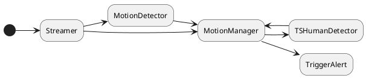

# RTSP Analyser

Analyse video stream to detect human.

Make lightweight to be execute on RPI 4.

## Workflow



## Tools to build

- CMake
- Vcpkg
- Ninja

## Dependencies

- OpenCV 4
- Niels Lohmann JSON
- Boost
- Boost Asio

## Raspberry Pi OS - Raspbian

```bash
sudo apt update
sudo apt install -y git wget curl build-essential make cmake ninja-build pkg-config autoconf automake libtool bison meson
sudo apt install -y gcc-aarch64-linux-gnu g++-aarch64-linux-gnu
sudo apt install -y libx11-dev libxft-dev libxext-dev libxi-dev libxtst-dev libxrandr-dev nasm gcc-11 libgles2-mesa-dev libdbus-1-dev:arm64 libsystemd-dev libglib2.0-dev libatspi2.0-dev libgtk2.0-dev
sudo apt install -y ffmpeg libopencv-dev libopencv-highgui-dev libopencv-objdetect-dev opencv-data

sudo pip install --upgrade --break-system-packages meson ninja
```

### Vcpkg

```bash
# Vcpkg install https://learn.microsoft.com/fr-fr/vcpkg/get_started/get-started?pivots=shell-bash
git clone https://github.com/microsoft/vcpkg.git
cd vcpkg
export VCPKG_FORCE_SYSTEM_BINARIES=1
./bootstrap-vcpkg.sh -disableMetrics
```

Modify **.bashrc**

```bash
export VCPKG_ROOT="/home/pi/vcpkg"
export PATH="$PATH:$VCPKG_ROOT"
export VCPKG_FORCE_SYSTEM_BINARIES=1
```

## Install dependencies

### nlohmann json

```bash
git clone https://github.com/nlohmann/json.git
cd json
mkdir build
cd build
cmake ..
make -j$(nproc)
sudo make install
```

### OpenCV with contrib

```bash
mkdir opencvlib
cd opencvlib
git clone https://github.com/opencv/opencv.git
git clone https://github.com/opencv/opencv_contrib.git
mkdir build
cd build
cmake -D WITH_GTK=ON -DOPENCV_EXTRA_MODULES_PATH=../opencv_contrib/modules ../opencv
cmake --build . -j $(nproc)
sudo make install
```

## TO DO

- Test & Impl Mouvement detectection                Testing
- Test & Impl Tensorflow Lite human detection  
  via image classification thanks to MobilNetv2
- Impl SMTP client to send e-mail
- Use JSON for config file                          OK
- ...
