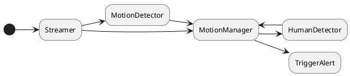

# RTSP Analyser

Analyse video stream to detect human.

Make lightweight to be execute on RPI 4.

## Workflow



## Dependencies

- OpenCV 4
- Niels Lohmann JSON
- Boost
- Boost Asio
- TensorFlow CC
- fmt

## Raspberry Pi 4 --> Ubuntu 24.04.1 LTS

```bash
sudo apt update
sudo apt upgrade -y
```

### Drivers : OpenCL & Vulkan

```bash
sudo apt install -y mesa-opencl-icd clinfo vulkan-tools

# check with clinfo & vulkaninfo
clinfo

vulkaninfo
```

### Compiler, ...

```bash
sudo apt install -y git wget curl build-essential make cmake ninja-build pkg-config autoconf automake libtool bison meson autoconf-archive libc++-dev
```

### CMake

```bash
sudo apt-get install libssl-dev

wget https://github.com/Kitware/CMake/releases/download/v3.31.5/cmake-3.31.5.tar.gz
tar -xzvf cmake-3.31.5.tar.gz
cd cmake-3.31.5
./bootstrap
make -j$(nproc)
sudo make install

cmake --version
```

### Bazel

[https://github.com/bazelbuild/bazel/releases/tag/5.4.1](https://github.com/bazelbuild/bazel/releases/tag/5.4.1)

```bash
wget https://github.com/bazelbuild/bazel/releases/download/5.1.1/bazel-5.1.1-linux-arm64

# or for x64

wget https://github.com/bazelbuild/bazel/releases/download/5.1.1/bazel-5.1.1-linux-x86_64

sudo mv bazel* /usr/local/bin/bazel
sudo chmod 0777 /usr/local/bin/bazel

# verify with
bazel --version
```

### Libs

```bash
sudo apt install -y libx11-dev libxft-dev libxext-dev libxi-dev libxtst-dev libxrandr-dev nasm gcc-11 libgles2-mesa-dev libdbus-1-dev libsystemd-dev libglib2.0-dev libatspi2.0-dev \
libgtk2.0-dev ffmpeg libopencv-dev libopencv-highgui-dev libopencv-objdetect-dev opencv-data opencl-headers libgtk-3-dev \
libavcodec-dev libavformat-dev libswscale-dev libv4l-dev libxvidcore-dev libx264-dev libx265-dev libjpeg-dev libpng-dev libtiff-dev \
gfortran openexr libatlas-base-dev python3-dev python3-numpy libtbb12 libtbb-dev libdc1394-25 libdc1394-dev libopenexr-dev \
libgstreamer-plugins-base1.0-dev libgstreamer1.0-dev ocl-icd-opencl-dev libvulkan-dev libglew-dev ocl-icd-dev

sudo apt install -y python3 python3-pip python3-dev
pip install --break-system-packages numpy
```

### Vcpkg

[Microsoft Guide Vcpkg installation](https://learn.microsoft.com/fr-fr/vcpkg/get_started/get-started?pivots=shell-bash)

```bash
git clone https://github.com/microsoft/vcpkg.git
cd vcpkg
export VCPKG_FORCE_SYSTEM_BINARIES=1
./bootstrap-vcpkg.sh -disableMetrics
```

#### Add to **~/.bashrc**

```bash
export VCPKG_ROOT="/home/$USER/vcpkg"
export PATH="$PATH:$VCPKG_ROOT"
export VCPKG_FORCE_SYSTEM_BINARIES=1
```

## Install dependencies

### nlohmann json

```bash
cd ~/libs
git clone https://github.com/nlohmann/json.git
cd json
mkdir build && cd build
cmake ..
make -j$(nproc)
sudo make install
```

### OpenCV with contrib

```bash
cd ~/libs
mkdir opencvlib && cd opencvlib
git clone https://github.com/opencv/opencv.git
git clone https://github.com/opencv/opencv_contrib.git
mkdir build && cd build

# on x86_64 arch
cmake \
  -D WITH_GTK=ON \
  -D WITH_OPENCL=ON \
  -D WITH_VULKAN=ON \
  -D WITH_OPENGL=ON \
  -D WITH_TBB=ON \
  -D BUILD_EXAMPLES=OFF \
  -DOPENCV_EXTRA_MODULES_PATH=../opencv_contrib/modules \
  ../opencv

# on ARM arch
cmake \
  -D ENABLE_NEON=ON \
  -D WITH_GTK=ON \
  -D WITH_OPENCL=ON \
  -D WITH_VULKAN=ON \
  -D WITH_OPENGL=ON \
  -D WITH_TBB=ON \
  -D BUILD_EXAMPLES=OFF \
  -DOPENCV_EXTRA_MODULES_PATH=../opencv_contrib/modules \
  ../opencv


cmake --build . -j $(nproc)
sudo make install
sudo ldconfig

# verify with
python3 -c "import cv2; print(cv2.getBuildInformation())"
```

### TensorFlow CC

Thanks to [https://github.com/FloopCZ/tensorflow_cc](https://github.com/FloopCZ/tensorflow_cc)

```bash
sudo apt install g++-11
cd ~/libs

git clone https://github.com/FloopCZ/tensorflow_cc.git
cd tensorflow_cc/tensorflow_cc/

# if you dev on a machine with Cuda tools installed but we didn't need in our case
# the goal is to compile on a Raspberry
# we modify the CMakeLists.txt
# change " option(ALLOW_CUDA "Try to find and use CUDA." ON) "
# to " option(ALLOW_CUDA "Try to find and use CUDA." OFF) "
# That will disable Cuda support for TensorFlow

mkdir build && cd build

export CC=/usr/bin/gcc-11
export CXX=/usr/bin/g++-11

# for arm build
export CC_OPT_FLAGS="-march=native"

# on x86_64 arch
cmake ..
make -j $(nproc)

# on arm arch
cmake -DLOCAL_RAM_RESOURCES=2048 -DLOCAL_CPU_RESOURCES=1 ..
make

sudo make install
sudo ldconfig
```

## TO DO

- Test & Impl Mouvement detectection                Testing
- Test & Impl Tensorflow Lite human detection  
  via image classification thanks to MobilNetv2
- Impl SMTP client to send e-mail
- Use JSON for config file                          OK
- ...
